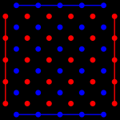
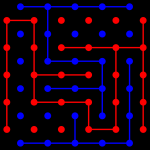

# Предложение прототипа игры
В данном документе будет предложен вариант прототипа игры для второго семестра Yandex Practicum

## Предложенный вариант игры
Перебрось мостик - Трубопровод - Bridg It

Ссылка на описание игры
[Bridg It](https://ru.wikipedia.org/wiki/%D0%9F%D0%B5%D1%80%D0%B5%D0%B1%D1%80%D0%BE%D1%81%D1%8C_%D0%BC%D0%BE%D1%81%D1%82%D0%B8%D0%BA)

## Краткое описание

Bridg It - абстрактная игра для двух игроков. Играют на доске 5 х 5 (возможны  и варианты с большим числом клеток). 

Стартовая позиция 

Ход игры

